# Builder Belt Level 4 Presentation Guide: Talambag

This guide is designed for a Builder Journey discussion about **Builder Belt Level 4** using the Talambag repository as the concrete reference implementation.

Talambag is a Soroban-powered community pooling app. It lets real-world groups create shared contribution pools, accept member deposits, allow organizer withdrawals, and keep the frontend synchronized through indexed contract events.

## 1. Builder Belt Level 4 Overview

### Level 4 Focus

Builder Belt Level 4 moves a project from a single-contract demo into a more production-like dApp architecture. The level expects builders to think about contracts, frontend state, event streaming, responsive UX, and CI/CD as one connected system.

### Objectives

| Objective | What it means in practice | Where Talambag shows it |
|---|---|---|
| Inter-contract calls | One contract invokes another contract to coordinate state or behavior. | `contracts/src/lib.rs` calls the rewards contract from `register_group_with_rewards` and `record_contribution_with_rewards`. |
| Custom token creation | A dedicated contract defines token-like metadata, balances, supply, transfers, burns, and claims. | `contracts/rewards/src/lib.rs` implements `RewardTokenContract` with `metadata`, `balance`, `total_supply`, `transfer`, `burn`, and `claim_rewards`. |
| Liquidity pool mechanics | Users interact with pooled balances using deposits and withdrawals. | `Pool` state in `contracts/src/lib.rs` tracks balances, deposits, organizer withdrawals, and token transfers. |
| CI/CD setup | GitHub Actions validates contracts, frontend, indexer, and optional deployment. | `.github/workflows/ci-and-deploy.yml`. |
| Mobile responsive design | The app works cleanly on desktop and mobile, including wallet and transaction states. | `frontend/src/app/globals.css`, responsive pages, and mobile screenshots under `frontend/public/screenshots/`. |
| Advanced event streaming | Contract events are indexed and streamed to the frontend in near real time. | `indexer/src/server.ts`, `indexer/src/indexer.ts`, `frontend/src/lib/realtime-events.ts`. |

## 2. Expected Outputs For Completion

For Level 4, the participants should leave with these outputs:

1. All GitHub Actions checks passing.
2. A mobile responsive app.
3. At least one real inter-contract call.
4. Advanced event streaming so frontend state stays synchronized without manual refresh.
5. At least 4 meaningful commits.
6. A complete README.
7. Optional: custom token and liquidity pool mechanics.

Talambag goes beyond the minimum because it includes both optional items:

- A reward-token contract.
- Contribution pool mechanics with deposit and withdrawal flows.

## 3. Repository Architecture

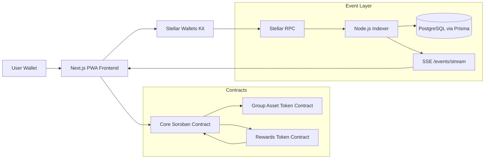

### Main Project Areas

| Area | Purpose | Key files |
|---|---|---|
| `contracts/` | Soroban Rust workspace for the core pooling contract. | `contracts/src/lib.rs`, `contracts/src/test.rs` |
| `contracts/rewards/` | Reward token contract. | `contracts/rewards/src/lib.rs`, `contracts/rewards/src/test.rs` |
| `frontend/` | Next.js 15 PWA with wallet connection, contract reads/writes, responsive UI, and realtime subscriptions. | `frontend/src/app/page.tsx`, `frontend/src/app/groups/[groupId]/page.tsx`, `frontend/src/app/groups/[groupId]/pools/[poolId]/page.tsx` |
| `indexer/` | Express service that polls Stellar RPC events, stores normalized events, and streams updates over SSE. | `indexer/src/server.ts`, `indexer/src/indexer.ts`, `indexer/src/normalize-event.ts`, `indexer/src/db.ts` |
| `.github/workflows/` | CI/CD pipeline. | `.github/workflows/ci-and-deploy.yml` |
| `README.md` | User-facing setup, architecture, demo screenshots, and CI badge. | `README.md` |

## 4. Core Contract Walkthrough

The core contract is implemented in `contracts/src/lib.rs`.

### Main State

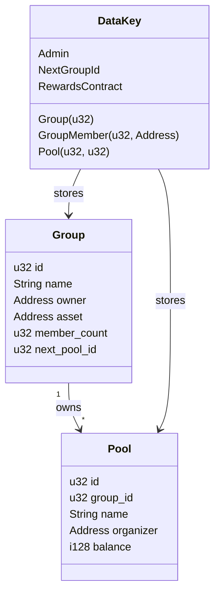

### Important Functions

| Function | Purpose | Key concept |
|---|---|---|
| `__constructor(admin)` | Stores the contract admin. | Initialization |
| `set_rewards_contract(admin, rewards_contract)` | Links the core contract to the reward contract. | Inter-contract setup |
| `create_group(owner, name, asset)` | Creates a group, stores owner membership, emits `group_created`. | Group lifecycle |
| `add_member(owner, group_id, member)` | Owner adds a wallet to a group. | Authorization |
| `create_pool(creator, group_id, name)` | Group member creates a pool and becomes organizer. | Pool lifecycle |
| `deposit(from, group_id, pool_id, amount)` | Transfers asset tokens into the contract, updates pool balance, emits event, records reward. | Pool mechanics and rewards |
| `withdraw(organizer, group_id, pool_id, to, amount)` | Organizer transfers pool funds out if balance is enough. | Controlled withdrawals |
| `is_member(group_id, member)` | Read method used by frontend and rewards contract. | Cross-contract eligibility check |

### Pool Deposit And Withdrawal Flow

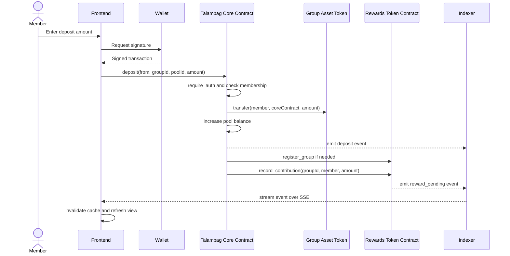

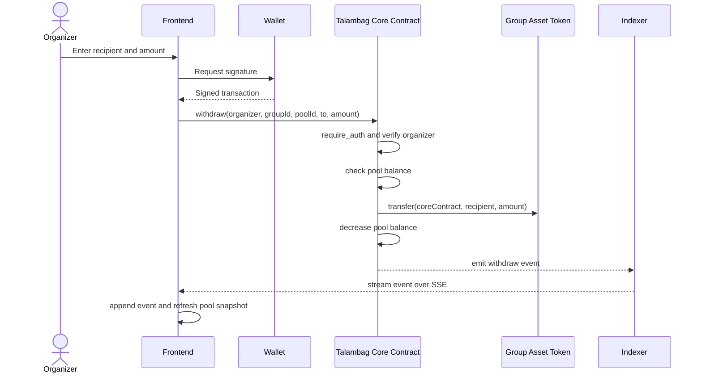

## 5. Inter-Contract Calls

Level 4 specifically asks for inter-contract calls. Talambag has two directions:

1. The core contract calls the rewards contract.
2. The rewards contract calls the core contract to verify membership before claims.

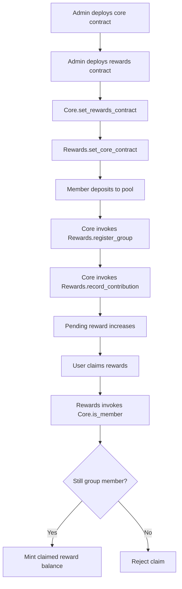

### Why This Matters

Inter-contract calls let each contract keep a focused responsibility:

- Core contract: group, membership, pool balance, deposits, withdrawals.
- Rewards contract: reward metadata, pending rewards, balances, supply, claims, transfers, burns.

This separation makes it easier to explain, test, and upgrade each domain independently.

## 6. Custom Token Contract

The rewards contract in `contracts/rewards/src/lib.rs` behaves like a project-specific reward token.

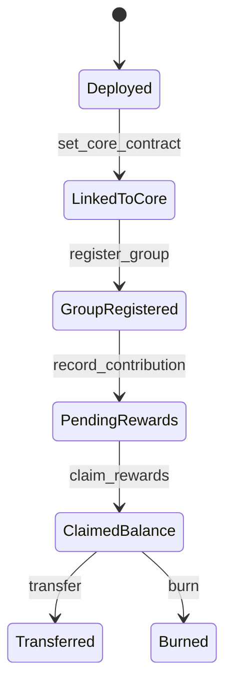

### Token-Like Capabilities

| Capability | Function |
|---|---|
| Metadata | `metadata()` |
| Total supply | `total_supply()` |
| Wallet balance | `balance(owner)` |
| Pending unclaimed rewards | `pending_reward(group_id, owner)` |
| Claim/mint rewards | `claim_rewards(user, group_id)` |
| Transfer reward tokens | `transfer(from, to, amount)` |
| Burn reward tokens | `burn(from, amount)` |

## 7. Advanced Event Streaming

Talambag does not rely only on frontend polling. It uses a dedicated indexer to watch contract events and push updates to browser clients.

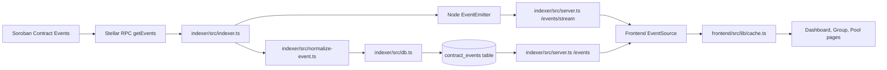

### Indexer Responsibilities

| File | Responsibility |
|---|---|
| `indexer/src/indexer.ts` | Polls Stellar RPC `getEvents`, handles cursors, batches, skipped events, and retry behavior. |
| `indexer/src/normalize-event.ts` | Decodes XDR topics and values into app-friendly event objects. |
| `indexer/src/db.ts` | Stores events and cursor state using Prisma transactions. |
| `indexer/src/server.ts` | Exposes `/health`, `/events`, and `/events/stream`. |
| `indexer/prisma/schema.prisma` | Defines `ContractEvent` and `IndexerState`. |

### Frontend Realtime Behavior

| File | Responsibility |
|---|---|
| `frontend/src/lib/realtime-events.ts` | Fetches indexed event history, opens `EventSource`, reconnects, normalizes events, and invalidates caches. |
| `frontend/src/app/page.tsx` | Subscribes to dashboard-level events. |
| `frontend/src/app/groups/[groupId]/page.tsx` | Subscribes to group-level events. |
| `frontend/src/app/groups/[groupId]/pools/[poolId]/page.tsx` | Subscribes to pool deposit and withdrawal events. |

### Realtime Event Lifecycle

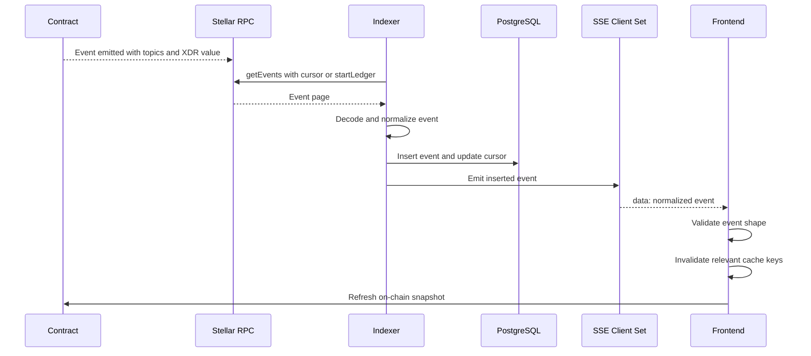

## 8. Frontend And Mobile Responsive Design

The frontend is a Next.js 15 app with wallet-aware pages and PWA behavior.

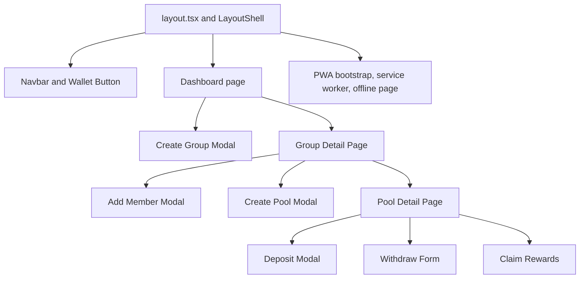

### UX Concepts To Explain

- Wallet state controls whether transaction buttons are enabled.
- Wrong network, offline mode, rejected signatures, and insufficient balance are handled as user-facing states.
- The app uses cache invalidation instead of trusting event payloads as the final source of truth.
- Contract reads still come from the Soroban RPC so the chain remains the source of truth.
- CSS uses responsive grids, wrapping, safe-area padding, and mobile screenshots are included in `frontend/public/screenshots/`.

## 9. CI/CD Pipeline

The workflow is defined in `.github/workflows/ci-and-deploy.yml`.

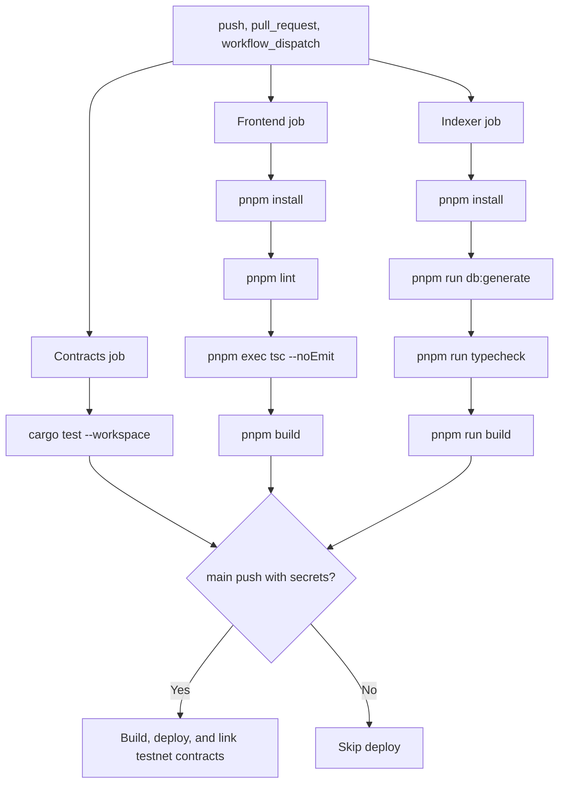

### What Participants Should Notice

- Contract tests run independently from frontend and indexer checks.
- Frontend checks include lint, typecheck, and production build.
- Indexer checks include Prisma client generation, typecheck, and build.
- Testnet deployment is gated behind `main` branch push and required secrets.
- Deployment links both contracts after deploying them.

## 10. Suggested Live Demo Flow

Use the demo to connect the objectives to the actual app behavior.

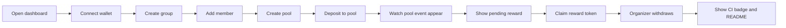

### Demo Script

1. Open the deployed app or local frontend.
2. Connect a wallet on the expected network.
3. Create a group.
4. Add a member wallet.
5. Create a pool inside the group.
6. Deposit into the pool.
7. Show the pool activity updating from indexed events.
8. Show reward state changing after a deposit.
9. Claim rewards from the rewards contract.
10. Perform or explain organizer withdrawal.
11. Open GitHub Actions and show passing checks.
12. Open the README and screenshots as the final expected output reference.

## 11. How The Solution Was Built

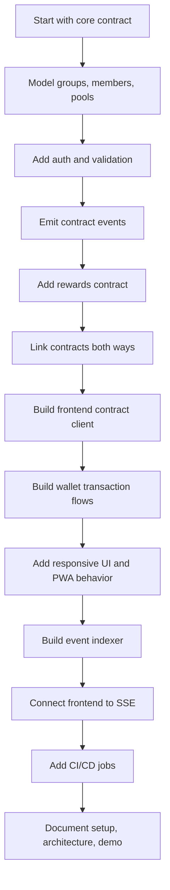

### Implementation Concepts

| Concept | Practical explanation |
|---|---|
| Contract storage keys | `DataKey` enums keep state access explicit and typed. |
| Authorization | `require_auth()` protects owner, organizer, and user actions. |
| Events as sync signals | Events tell the frontend what changed, then the frontend refreshes authoritative contract reads. |
| Cursor-based indexing | The indexer stores the last cursor so it can continue from the previous processed event. |
| Idempotent event persistence | Duplicate event inserts are ignored using Prisma unique constraint handling. |
| Graceful reconnect | Frontend `EventSource` reconnects when online and closes when offline. |
| CI separation | Contracts, frontend, and indexer are validated as separate jobs. |

## 12. Practical Tips

1. Start with a simple contract model before adding a second contract.
2. Emit events for every state-changing action the frontend cares about.
3. Treat events as invalidation signals, not as the full database.
4. Store indexer cursors so redeploys and restarts do not reprocess everything.
5. Keep inter-contract responsibilities clear. Do not put reward-token logic in the pool contract if it can be isolated.
6. Add contract tests before wiring UI flows.
7. Make transaction states visible: signing, submitting, success, rejected, and error.
8. Build for mobile early because wallet flows often happen on small screens.
9. Keep README setup steps aligned with actual scripts and environment variables.
10. Make commits meaningful by grouping work by layer or feature.

## 13. Common Pitfalls

| Pitfall | How Talambag avoids or handles it |
|---|---|
| Forgetting to link both contracts | CI deployment calls both `set_rewards_contract` and `set_core_contract`. |
| Trusting frontend-only state | Contract snapshots are refreshed after realtime events. |
| No replay protection in indexer | Events use `eventId` as a unique primary key. |
| Indexer restart loses progress | Cursor state is stored in `IndexerState`. |
| Event payloads are hard to read | `normalize-event.ts` decodes XDR into normalized JSON fields. |
| Wallet rejection shown as a crash | Frontend classifies rejected signatures separately. |
| Mobile layout breaks long addresses | CSS uses wrapping and address-shortening helpers. |
| CI only checks one layer | Workflow validates contracts, frontend, and indexer separately. |

## 14. Best Practices To Emphasize

- Keep contracts small and explicit.
- Use one contract for core business rules and another for token/reward accounting.
- Test cross-contract behavior in Rust before showing it in the UI.
- Normalize blockchain events before sending them to the browser.
- Use Server-Sent Events when you need simple one-way realtime updates.
- Always expose a health endpoint for services like the indexer.
- Build a responsive UI that handles disconnected, offline, wrong-network, and pending-transaction states.
- Keep CI fast enough to run on every pull request.
- Document the repository so future builders can reproduce the result.

## 15. Presenter Checklist

Before the session:

- [ ] Open `README.md`.
- [ ] Open `.github/workflows/ci-and-deploy.yml`.
- [ ] Open `contracts/src/lib.rs`.
- [ ] Open `contracts/rewards/src/lib.rs`.
- [ ] Open `indexer/src/server.ts`.
- [ ] Open `frontend/src/lib/realtime-events.ts`.
- [ ] Prepare the deployed app or local app.
- [ ] Prepare the GitHub Actions page showing passing checks.
- [ ] Prepare the screenshots under `frontend/public/screenshots/`.

During the session:

- [ ] Explain the Level 4 objectives first.
- [ ] Map each objective to the actual files.
- [ ] Walk through deposit as the main end-to-end flow.
- [ ] Show the inter-contract call between core and rewards.
- [ ] Show the event stream and cache invalidation flow.
- [ ] Show mobile responsive screenshots or live resize.
- [ ] Close with tips, pitfalls, and expected participant outputs.

## 16. One-Slide Summary

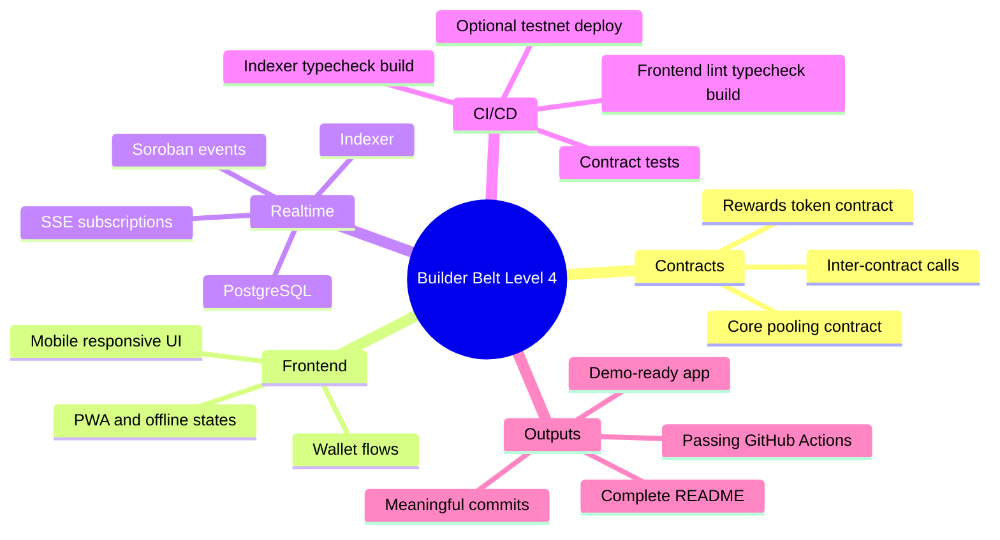

